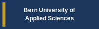
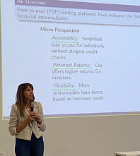

<nav class="nav-container">
  <ul class="nav-menu">
    <li><a href="#home">Home</a></li>
    <li><a href="#team">Team</a></li>
    <li><a href="#research">Research</a></li>
    <li><a href="#publications">Publications</a></li>
    <li><a href="#events">Events</a></li>
    <li><a href="#collaborations">Collaborations</a></li>
    <li><a href="#funding">Funding</a></li>
    <li><a href="#contact">Contact</a></li>
  </ul>
</nav>

<section id="home">

  
  

  

    90,000
    CHF Funding
  

  

    {{ site.data.publications | size }}
    Publications
  

  

    6
    Collaborations
  

  

    4
    Researchers
  

> This SNSF-funded project develops advanced, interpretable credit risk models tailored specifically to the needs of Peer-to-Peer (P2P) lending markets using network analysis and machine learning.

</section>

---

<section id="team">

## Our Team

*International cooperation between Bern Business School (Switzerland) and partner institutions*

  
  Principal Investigator
  <h4>Prof. Dr. Joerg Osterrieder</h4>
  
Bern Business School, Switzerland University of Twente, Netherlands

  
  Researcher
  <h4>Lennart John Baals</h4>
  
Bern Business School, Switzerland University of Twente, Netherlands

  
  Researcher
  <h4>Prof. Dr. Branka Hadji Misheva</h4>
  
Bern Business School, Switzerland

  
  Researcher
  <h4>Dr. Yiting Liu</h4>
  
Bern Business School, Switzerland University of Twente, Netherlands

</section>

---

<section id="research">

## Research Project

### Background

Peer-to-peer (P2P) lending has become an increasingly popular alternative to traditional bank lending, allowing individuals and businesses to borrow money directly from investors through online platforms without involving banks. While this method offers advantages such as higher returns for investors and greater access to credit for borrowers, it also brings unique risks. The decentralized nature of P2P lending means that loans are funded entirely by investors, without the safeguards of bank intermediation.

### Rationale

The growing presence of P2P lending markets, especially during economic crises, exposes these platforms to significant risks, including adverse selection and moral hazard. Unlike traditional banks that use long-term relationships and extensive data to evaluate borrowers, P2P platforms have less detailed information and face higher levels of uncertainty. There is a critical need for robust credit risk models that can accurately assess the creditworthiness of borrowers in these markets.

### Objectives

This project aims to develop **advanced, interpretable credit risk models** tailored specifically to the needs of P2P lending markets. These models will address the unique challenges of P2P lending, such as:

- Higher information asymmetry
- Less regulation compared to traditional banking
- Increased risk during economic downturns

The ultimate goal is to enhance trust between investors and P2P platforms by providing accurate tools for evaluating and mitigating credit risk.

### Methods

The project develops credit risk models using **network-based approaches**, analyzing the connections between borrowers and lenders to identify patterns that indicate heightened risk. These models incorporate:

- **Static factors**: Established risk indicators
- **Dynamic factors**: Real-time data for adaptive risk assessment
- **Network topology**: Graph-based features capturing borrower-lender relationships

### Expected Impact

By providing more reliable credit risk models, this project will strengthen the P2P lending market, making it a more secure and viable alternative to traditional bank lending. The results will be valuable to:

- P2P platforms and investors
- Policymakers and regulators
- Financial institutions
- Academic researchers

</section>

---

<section id="publications">

## Scientific Publications

*Auto-updated from [OpenAlex.org](https://openalex.org) - {{ site.data.publications | size }} publications*



  
{{ pub.title }}

  
{{ pub.authors }} ({{ pub.year }}) - <em>{{ pub.journal }}</em>

  

    <a href="https://doi.org/{{ pub.doi }}" class="doi-link" target="_blank">DOI</a>
    {{ pub.citations }} citations
    Open Access
  





<em>Showing 20 of {{ site.data.publications | size }} publications. <a href="https://openalex.org/authors/A5047295072">View all on OpenAlex</a></em>



</section>

---

<section id="events">

## Academic Events

*The team has received invitations to numerous international conferences, serving roles as keynote speakers, session chairs, or organizing events.*

### 8th Bern Conference 2024

**September 29th, 2024** - Dr. Hadji-Misheva was invited as a speaker at an inaugural research conference on Fintech and AI in Finance at the Department of Business, Bern University of Applied Science. The talk titled *"Leveraging Network Topology for Credit Risk Assessment"* explored graph-theoretical concepts and their applications for research initiatives, advancements, and innovations in credit risk scoring.

</section>

---

<section id="collaborations">

## Collaborations

| Institution | Contact | Activities |
|-------------|---------|------------|
| **American University of Sharjah, UAE** | Prof. Dr. Stephen Chan | Constructive exchanges, Publications, Personnel exchange |
| **University of Manchester, UK** | Dr. Yuanyuan Zhang | Constructive exchanges, Publications |
| **Renmin University, China** | Prof. Dr. Jeffrey Chu | Constructive exchanges, Publications |
| **Bern Business School, Switzerland** | Prof. Dr. Branka Hadji Misheva | Constructive exchanges, Publications, Personnel exchange |

### Research Networks

**COST Action CA19130 - Fintech and Artificial Intelligence in Finance**
- Action Chair: Joerg Osterrieder
- In-depth constructive exchanges on approaches, methods, and results
- Joint publications and personnel exchange

**MSCA Industrial Doctoral Network on Digital Finance**
- Coordinator: Joerg Osterrieder
- Cross-institutional research collaboration
- Doctoral training and knowledge transfer

</section>

---

<section id="funding">

## Third-Party Funds

*The team has acquired research funds from national and international organizations, including the Swiss National Science Foundation and Horizon Europe.*

  <h3>Leading House Asia: 2023 Call for Applied Research Partnerships, ETH</h3>
  50,000 CHF
  <dl class="funding-details">
    <dt>Institution</dt>
    <dd>Bern University of Applied Science, CH</dd>
    <dt>Proposal Number</dt>
    <dd>FRG24-E-S25</dd>
    <dt>Grant Period</dt>
    <dd>1 June 2024 - 31 May 2025</dd>
    <dt>Title</dt>
    <dd>From Digits to Dollars: The Evolution of Price Impact in Digital Assets</dd>
    <dt>Team</dt>
    <dd>Yiting Liu (PI); Joerg Osterrieder (Co-PI)</dd>
  </dl>

  <h3>SNSF Mobility Grant 2024 / 1</h3>
  20,000 CHF
  <dl class="funding-details">
    <dt>Proposal Number</dt>
    <dd>100018E_205487 / 3</dd>
    <dt>Grant Period</dt>
    <dd>1 February 2024 - 31 August 2024</dd>
    <dt>Title</dt>
    <dd>Network-based credit risk models in P2P lending markets</dd>
    <dt>Team</dt>
    <dd>Lennart John Baals (PI); Joerg Osterrieder (Co-PI)</dd>
  </dl>

  <h3>SNSF Mobility Grant 2024 / 2</h3>
  20,000 CHF
  <dl class="funding-details">
    <dt>Proposal Number</dt>
    <dd>100018E_205487 / 2</dd>
    <dt>Grant Period</dt>
    <dd>1 February 2024 - 31 August 2024</dd>
    <dt>Title</dt>
    <dd>Network-based credit risk models in P2P lending markets</dd>
    <dt>Team</dt>
    <dd>Yiting Liu (PI); Joerg Osterrieder (Co-PI)</dd>
  </dl>

  <h3>Total Funding Secured: 90,000 CHF</h3>

</section>

---

<section id="contact">

## Contact Us

<form class="contact-form" action="https://formspree.io/f/mzzbkwqv" method="POST">
  

    <label for="name">Your Name</label>
    <input type="text" id="name" name="name" required placeholder="Enter your full name">
  

  

    <label for="email">Email Address</label>
    <input type="email" id="email" name="email" required placeholder="Enter your email">
  

  

    <label for="subject">Subject</label>
    <input type="text" id="subject" name="subject" required placeholder="What is this regarding?">
  

  

    <label for="message">Message</label>
    <textarea id="message" name="message" required placeholder="Your message..."></textarea>
  

  <button type="submit">Send Message</button>
</form>

  
<strong>Principal Investigator:</strong> Prof. Dr. Joerg Osterrieder

  
<strong>Institution:</strong> Bern University of Applied Sciences (BFH), Department of Business

  
<strong>Address:</strong> Bruckenstrasse 73, 3005 Bern, Switzerland

</section>

---

<footer class="site-footer">
  

    

      
&copy; 2025 Digital AI Finance Research Group

      
Source: <a href="https://www.digital-finance-msca.com/network-based-credit-risk-models-snsf">digital-finance-msca.com</a>

    

    

      <a href="https://github.com/Digital-AI-Finance/network-based-credit-risk-models">GitHub</a>
      <a href="https://github.com/Digital-AI-Finance/network-based-credit-risk-models/wiki">Wiki</a>
    

  

</footer>

